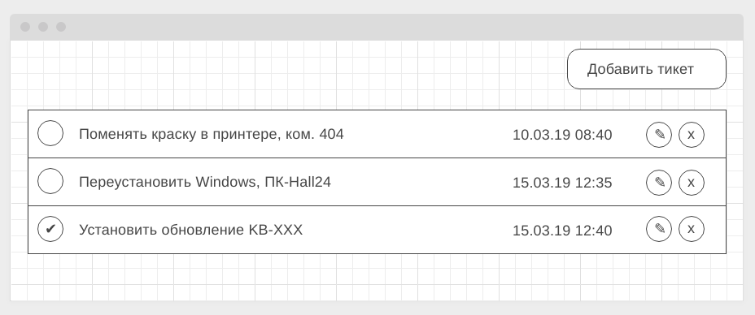
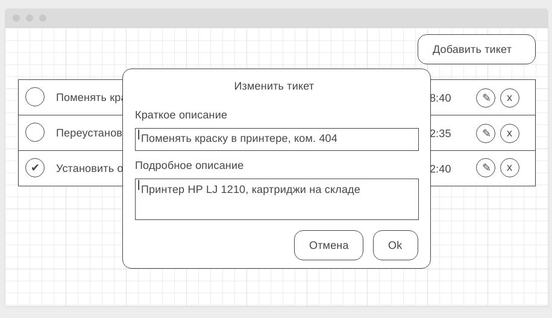
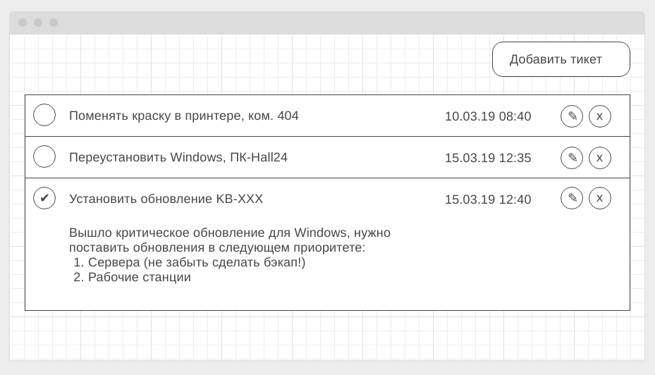

# Домашнее задание к занятию «Работа с HTTP»

Правила сдачи задания:

1. **Важно**: в рамках этого домашнего задания нужно использовать npm (а значит, никакого `yarn.lock` в репозитории быть не должно)
1. Frontend должен собираться через Webpack (включая картинки и стили) и выкладываться на Github Pages через Github
   Actions. Пример реализации деплоя был в первой домашней работе из этого блока, называется "Рабочее окружение".
1. В README.md должен быть размещён бейджик сборки и ссылка на Github Pages
1. В качестве результата присылайте проверяющему ссылки на GitHub-репозиторий
1. Авто-тесты писать не требуется

**Важно**: в данном домашнем задании вам потребуется выполнить мини-проект. Мы понимаем, что он может занять чуть больше времени, чем обычные задания, но тема HTTP настолько важна, что стоит уделить этому чуть больше времени.

---

## `HelpDesk: Frontend`

### Легенда

API готово, пора приступить к своим прямым обязанностям — написанию фронтенда, который будет с этим API работать.

### Описание

Общий вид списка тикетов (должны загружаться с сервера в формате JSON):

Модальное окно добавления нового тикета (вызывается по кнопке "Добавить тикет" в правом верхнем углу):

Модальное окно редактирования существующего тикета (вызвается по кнопке с иконкой "✎" — карандашик):

Модальное окно подтверждения удаления (вызывается по кнопке с иконкой "x" — крестик):

Для просмотра деталей тикета нужно нажать на тело тикета (но не на кнопки — "сделано", "редактировать" или "удалить"):

Ваше приложение должно реализовывать следующий функционал:

* Отображение всех тикетов
* Создание нового тикета
* Удаление тикета
* Изменение (обновление) тикета
* Отметка о выполнении каждого тикета

Весь этот функционал должен быть связан с сервером через методы. Например, для удаления нужно отправить запрос с соответствующим методом, получить подтверждение и подтянуть обновлённый список тасков.

В качестве бонуса можете отображать какую-нибудь иконку загрузки (см. https://loading.io) на время подгрузки.

Преднастроенный репозиторий для фронтенд части можно посмотреть [здесь](https://github.com/netology-code/ahj-homeworks/tree/AHJ-50/http/helpdesk/frontend).

Вы можете реализовывать структуру, заложенную в нём, либо написать свою.

Авто-тесты к данной задаче не требуются. Все данные и изменения должны браться/сохраняться на сервере.

Заметка

Для получения данных с сервера вы можете использовать [XMLHttpRequest](https://developer.mozilla.org/ru/docs/Web/API/XMLHttpRequest/Using_XMLHttpRequest) или [fetch API](https://developer.mozilla.org/ru/docs/Web/API/Fetch_API/Using_Fetch). Мы рекомендуем в fetch, но выбор остаётся за вами.

P.S. Подгрузка подробного описания специально организована в виде отдельного запроса. Мы понимаем, что на малых объёмах информации нет смысла делать её отдельно.